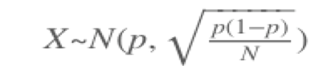
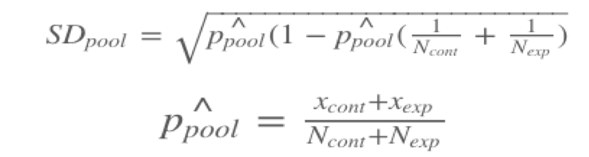

A/B Testing to Determine an Effective Approach to Reduce Early Udacity Course Cancellation
==========================================================================================

Experiment Overview
----------------------

At the time of this experiment, Udacity courses currently have two options on the home page: "start free trial", and "access course materials". If the student clicks "start free trial", they will be asked to enter their credit card information, and then they will be enrolled in a free trial for the paid version of the course. After 14 days, they will automatically be charged unless they cancel first. If the student clicks "access course materials", they will be able to view the videos and take the quizzes for free, but they will not receive coaching support or a verified certificate, and they will not submit their final project for feedback.

In the experiment, Udacity tested a change where if the student clicked "start free trial", they were asked how much time they had available to devote to the course. If the student indicated 5 or more hours per week, they would be taken through the checkout process as usual. If they indicated fewer than 5 hours per week, a message would appear indicating that Udacity courses usually require a greater time commitment for successful completion, and suggesting that the student might like to access the course materials for free. At this point, the student would have the option to continue enrolling in the free trial, or access the course materials for free instead. The experiment looks like: 

The hypothesis was that this might set clearer expectations for students upfront, thus reducing the number of frustrated students who left the free trial because they didn't have enough time—without significantly reducing the number of students to continue past the free trial and eventually complete the course. If this hypothesis held true, Udacity could improve the overall student experience and improve coaches' capacity to support students who are likely to complete the course.

The unit of diversion is a cookie, although if the student enrolls in the free trial, they are tracked by user-id from that point forward. The same user-id cannot enroll in the free trial twice. For users that do not enroll, their user-id is not tracked in the experiment, even if they were signed in when they visited the course overview page.

This [article](https://towardsdatascience.com/a-summary-of-udacity-a-b-testing-course-9ecc32dedbb1) has the great summary of the Udaicty A/B testing course

Experimental Design
-------------------

### All Metrics

* **Number of cookies**: Number of unique cookies to view course overview page.
* **Number of clicks**: Number of unique cookies to click the "Start Free Trial" button (which happens before the free trial screener is triggered).
* **Number of user-ids**: Number of users who enroll in the free trial.
* **Click-through-probability**: Number of unique cookies to click the "Start Free Trial" button divided by number of unique cookies to view the course overview page.
* **Gross conversion**: Number of user-ids to complete checkout and enroll in free trial divided by number of unique cookies to click "Start Free Trial" button.
* **Retention**: Number of user-ids to remain enrolled past the 14-day boundary (and thus make atleast one payment) divided by number of users to enroll in the free trial.
* **Net conversion**: Number of user-ids to remain enrolled past the 14-day boundary divided by the number of unique cookies to click the "Start Free Trial" button.

### Metric Choice

Invariant metrics are those should not be affected by experiment. One could expect a similar result of such metrics both on control and experiment groups.
The invariant metrics for the given test are as follow:
#### Invariant metrics:
  1. **Number of cookies**: This is the unit of diversion and since the visits to the course page happen before the experiment, we should expect similar metrics between control and experiment groups.

  2. **Number of clicks**: Since the clicks happen before the screener, the metric is independent of the test. So, the metric should be evenly distributed among the control and experiment groups.

  3. **Click-through-probability**: This metric is the ratio between the two metrics above. Since the two metrics above are not affected by the experiment, the ratio should not be affected too.


#### Evaluation metrics:
The evaluation metrics are used to measure which variation is better. Each evaluation metric is associated with a minimum difference (dmin) that must be observed for consideration in the decision to launch the experiment.
  1. **Gross conversion**: Ideally, we expect to the decreased gross conversion rate in the experiment group, because students will be deferred to enroll in the free trial if they know they don’t have enough studying. 

  2. **Rentention**: We expect the retention rate to go up because students have clearer expectation of the course time requirements and thus more likely to stay in the course after they enrolled.

  3. **Net conversion**: Ideally, net conversion rate would remain similar or increase in the experiment group. Students remain enrolled past the 14-day boundary might be similar between the control and experiment groups. The difference is that unprepared students in the experiment would enroll after they the screener while the unprepared students in the control group would drop within the first 14 days. On the other hand, since students are well informed, the students in the experiment may plan accordingly and still choose to enroll with fewer dropouts. So, the net conversion rate might go up. 


#### Unused metrics:

  1. **Number of user-ids**: User-ids are tracked only after enrolling in the free trial and equal distribution between the control and experimental branches would not be expected. User-id count could be used to evaluate how many enrollments stayed beyond the 14 day free trial boundary, but it is not normalized which means the number of cookies could have effect (Gross conversion would be better as it is normalized)


### Measuring Variability

Calculate the Standard Deviation for both our Evaluation Metrics. Since all the evaluation metrics are probabilities, we can assume a binomial distribution, which will take on a normal distribution for a large enough sample size.

The Udacity baseline values can be [found here](https://docs.google.com/spreadsheets/d/1MYNUtC47Pg8hdoCjOXaHqF-thheGpUshrFA21BAJnNc/edit#gid=0).


```
Gross conversion: 
number of clicks = 5000 * 3200 / 40000 = 400 
Since the number of enrollment follows binomial distribution and the probability of enrolling giving click = 0.20625
SD = sqrt(400 * 0.20625 * (1-0.20625)) / 400 = 0.02023
```

```
Retention: 
number of enrollment = 5000 * 660 / 40000 = 82.5
probability of payment given enroll = 0.53
SD = sqrt(82.5 * 0.53 * (1-0.53)) / 82.5 = 0.054949
```

```
Net conversion:
probability of payment given clicks = 0.1093125
SD = sqrt(400* 0.1093125 * (1-0.1093125)) / 400= 0.0156
```

I would like to expect the analytical variance is close to the empirical variance for the gross conversion and for the net conversion: the denominator for these two indicators is the number of clicks, which is also the unit of diversion.
It would be useful to collect an empirical estimate of the variability for the retention: the unit of diversion was not used in this case, the empirical variance of the retention is more likely to be higher than the analytical variance.

### Sizing

#### Number of Samples vs Power

I did not use the Bonferroni correction, because the three evaluation metrics are highly correlated with each other and this method is very conservative which can increase the type two error. 

Using this [link](https://www.evanmiller.org/ab-testing/sample-size.html), we can calculate the sample size with alpha = 0.05 and beta 0.2 for all evaluation metrics

```
Gross conversion: 
Base Conversion Rate= 0.20625
dmin = 0.01
sample size = 25835
click / pageview ratio = 3200/40000 = 0.08
number of groups = 2
required pageviews = 645875
```

```
Retention: 
Base Conversion Rate= 0.53
dmin = 0.01
sample size = 39115
enrollment / pageview ratio = 660/40000 = 0.0165
number of groups = 2
required pageviews = 4741212
```

```
Net conversion:
Base Conversion Rate= 0.109313
dmin = 0.0075
sample size = 54826
click / pageview ratio = 3200/40000 = 0.08
number of groups = 2
required pageviews = 685325
```

We should choose the maximum pageviews among three metrics, so the pageviews needed should be 4741212

#### Duration vs Exposure

Since the required pageviews are 4741212 and the daily pageviews are 40000, we need around 119 days to run the experiment if we divert 100% traffic to the experiment. This would be too long and too risky as we probably won’t see any benefits from the experiment and we cannot make other experiments concurrently, but we spend all resources which become sunk cost. 

One way to fix this is to eliminate the retention metric. As a result, we only need 685325 pageviews, which only require 18 days to complete if 100% traffic is diverted to this experiment. Generally, this experiment has few risks. It would not affect existing users who had enrolled in the course. It only targets the students who are uncertain about taking the course, but not the students who are determined to take the course. The experiment won’t pose physical, emotional, social, or financial risks to the students and won’t involve in privacy data. So, we can put relatively large portion in this experiment. However, it is not pragmatic to put all the traffic in as we have to avoid some potential bugs and also leave some resources for other experiments. I will give 50% of the traffic, which requires 35 days to run the experiment. 

## Experiment Analysis

### Sanity Checks

Before further analysis, we should check whether the invariant metrics are unchanged for both the control or experiment groups. The data can be found [here](https://docs.google.com/spreadsheets/d/1Mu5u9GrybDdska-ljPXyBjTpdZIUev_6i7t4LRDfXM8/edit#gid=0).

For number of cookies and clicks, if the traffic is assigned to each group at random with probability 0.5, then the number of samples follow the binomial distribution. Thanks to central limit theorem, the probability of samples in each group approximates a normal distribution as 

```
Number of Cookies:
Number of pageviews in the control group: 345543
Number of pageviews in the experiment group: 344660
Observed Probability: 0.5006
Expected Probability:0.5
Standard Deviation: 0.0006
95% CI: [0.4988, 0.5012]
Since 0.5006 is in the confidence interval, so this metric passes the sanity check
```
```
Number of Clicks:
Number of clicks in the control group: 28378
Number of clicks in the experiment group: 28325
Observed Probability: 0.5005
Expected Probability:0.5
Standard Deviation: 0.002
95% CI: [0.4959, 0.5041]
Since 0.5005 is in the confidence interval, so this metric passes the sanity check
```
For click through probability(CTP), we want to test CTPexp - CTPcont = 0. The pooled standard error is 

```
Click-through-probability:
Probability in the control group: 0.082126
Probability in the experiment group: 0.08282
Pooled probability: 0.082154
Observed difference = 0.0001
Expected difference = 0
Standard Deviation: 0.0007
95% CI: [-0.0013, 0.0013]
Since 0.0001 is in the confidence interval, so this metric passes the sanity check. 
```

### Result Analysis

#### Effect Size Test

Since our experiment passed the sanity check, we can test whether the evaluation metrics are statistically and practically significant. Similar to the methodologies with the click-through-probability, we can check the 95% confidence intervals of the gross and net conversion rates. 

```
Gross Conversion Rate: 
Probability in the control group: 0.2189
Probability in the experiment group: 0.1983
Pooled probability: 0.2086
Observed difference = -0.0206
Standard Deviation: 0.0044
95% CI: [-0.0291, -0.0120]
Practical Significant Boundary: 0.01
Since 0 is not in the 95% CI, the metric is statistically significant as well as practically significant. 
```

```
Net Conversion Rate: 
Probability in the control group: 0.1176
Probability in the experiment group: 0.1127
Pooled probability: 0.1151
Observed difference = -0.0049
Standard Deviation: 0.0034
95% CI: [-0.0116, 0.0019]
Practical Significant Boundary: 0.0075
Since 0 is in the 95% CI, the metric is not statistically significant as well as not practically significant.  
```
